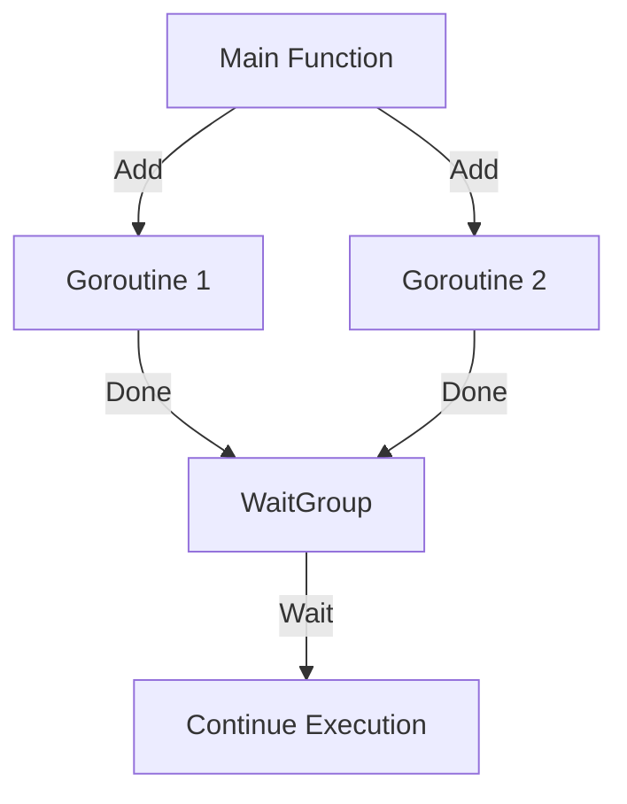

# Question 10: What is a `sync.WaitGroup`?  

## Introduction  
आज हम बात करेंगे `sync.WaitGroup` के बारे में। यह Go language में goroutines को synchronize करने का एक आसान तरीका है।  

## Key Points  

- **Definition**  
  * `sync.WaitGroup` goroutines के खत्म होने का wait करने के लिए use होता है।  
  * यह concurrency control का हिस्सा है।  
  (On-screen text: "`sync.WaitGroup` = Wait for goroutines")  

- **How it works**  
  * इसमें तीन functions होते हैं: `Add`, `Done`, और `Wait`।  
  * `Add` goroutine count बढ़ाता है।  
  * `Done` goroutine खत्म होने पर call होता है।  
  * `Wait` तब तक block करता है जब तक count zero न हो जाए।  
  (Narration cue: "`Add` to start, `Done` to finish, `Wait` to sync")  

- **Diagram**  

- **Use Case**  
  * जब multiple goroutines parallel चल रहे हों और हमें उनका काम पूरा होने का wait करना हो।  
  (On-screen text: "Use case: Parallel tasks sync")  

## Conclusion  
तो `sync.WaitGroup` हमें goroutines के खत्म होने तक wait करने देता है। Simple, powerful, और safe। अगर आपको concurrent code manage करना है, तो इसे जरूर use करें।  

---