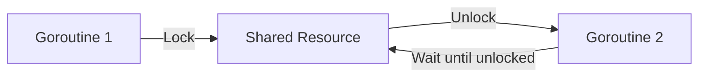

# Question 11: How does `sync.Mutex` work?  

## Introduction  
अब बात करेंगे `sync.Mutex` की। यह Go language में mutual exclusion lock है।  

## Key Points  

- **Definition**  
  * Mutex का मतलब है Mutual Exclusion।  
  * यह एक समय में सिर्फ एक goroutine को shared resource access करने देता है।  
  (On-screen text: "Mutex = Lock for safe access")  

- **How it works**  
  * Mutex के दो methods हैं: `Lock` और `Unlock`।  
  * जब एक goroutine resource लेता है तो वह lock करता है।  
  * काम खत्म होने पर उसे unlock करना जरूरी है।  
  (Narration cue: "Lock before use, Unlock after use")  

- **Diagram**  

- **Use Case**  
  * जब दो या ज्यादा goroutines same data access कर रहे हों।  
  * Mutex data corruption रोकता है।  
  (On-screen text: "Prevents race conditions")  

## Conclusion  
तो `sync.Mutex` concurrency में safety लाता है। यह simple lock और unlock system से data को safe रखता है। जब भी shared resource हो, Mutex का use जरूर करें।  

---