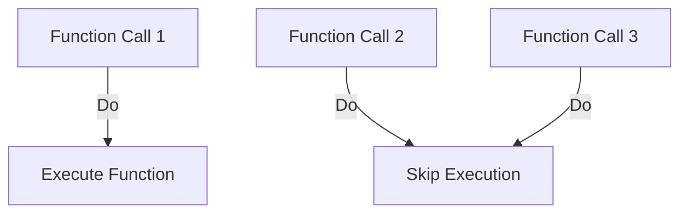

# Question 12: What is `sync.Once`?  

## Introduction  
अब हम समझेंगे `sync.Once` को। यह Go language का एक sync primitive है जो code सिर्फ एक बार चलाता है।  

## Key Points  

- **Definition**  
  * `sync.Once` का मतलब है कि कोई function सिर्फ एक बार execute होगा।  
  * चाहे कितनी बार call हो, function एक बार ही run होगा।  
  (On-screen text: "`sync.Once` = Run only once")  

- **How it works**  
  * `sync.Once` के पास `Do` method होता है।  
  * `Do` को एक function दिया जाता है।  
  * वही function सिर्फ पहली बार call पर चलेगा।  
  (Narration cue: "`Do` runs only once, even if called many times")  

- **Diagram**  

- **Use Case**  
  * Initialization code चलाने के लिए।  
  * जैसे database connection setup या configuration load।  
  (On-screen text: "Use case: Initialization")  

## Conclusion  
तो `sync.Once` हमें किसी भी function को सिर्फ एक बार चलाने की guarantee देता है। इससे initialization safe और आसान हो जाता है।  

---